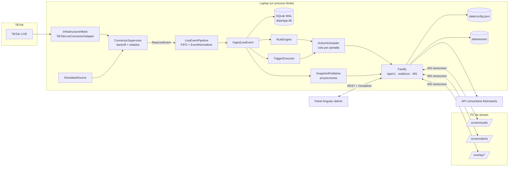
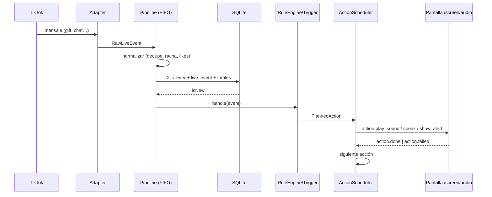
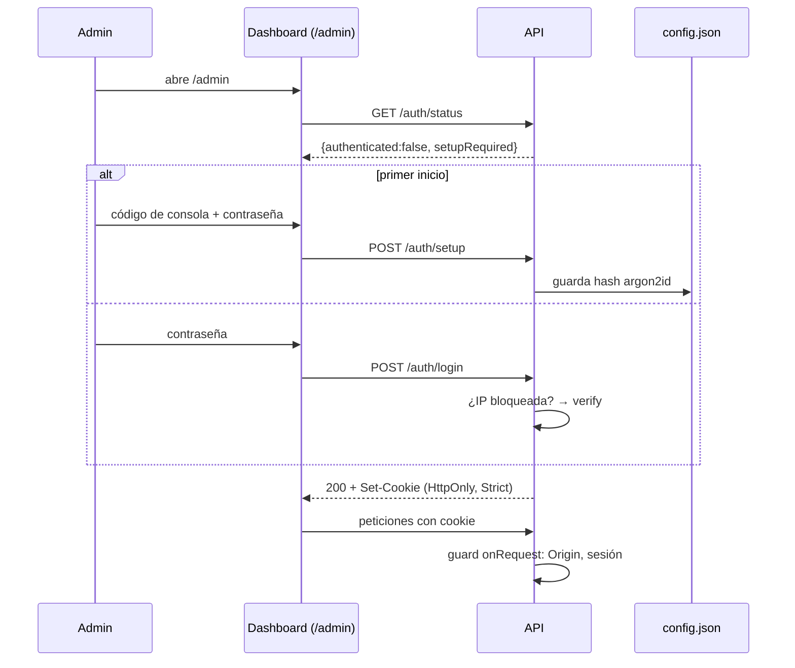
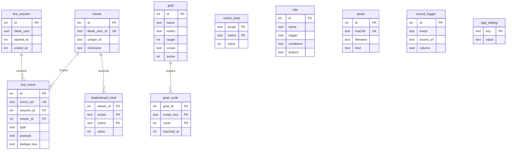
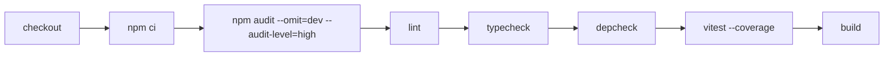

# DOCUMENTACIÓN TÉCNICA DEL PROYECTO — TikLive

> Generada el 2026-10-07 a partir del código fuente, la configuración y las ejecuciones de `vitest`, `eslint`, `tsc`, `depcruise` y `npm audit` hechas durante el análisis.
> Convención de estados: `IMPLEMENTADO` · `PARCIALMENTE IMPLEMENTADO` · `DETECTADO PERO NO UTILIZADO` · `CONFIGURADO PERO NO IMPLEMENTADO` · `REFERENCIADO PERO AUSENTE` · `NO DETERMINABLE` · `RECOMENDACIÓN`.
> Cada bloque separa **Evidencia encontrada**, **Interpretación** y **Recomendación**. Lo que no se pudo demostrar se marca: *"No fue posible determinarlo a partir del código analizado."*
> Alcance de la revisión: todo el repositorio salvo `node_modules/`, `dist/` y `data/`. No se leyó línea por línea cada componente Angular ni cada overlay; en esos casos se indica.

---

## 1. Resumen ejecutivo

**Qué es.** Plataforma local, de un solo proceso Node.js, que convierte los eventos de un TikTok LIVE propio (comentarios, regalos, likes, follows, entradas, shares, espectadores) en sonidos, voz (TTS), alertas visuales, rankings, metas y estadísticas, mostrados en pestañas/overlays que se cargan en la PC de stream (LIVE Studio / OBS). Se administra desde un panel Angular en `/admin/`.

**Estado.** Funcional y bien probado en simulador (208 pruebas en verde, lint, tipos y regla de capas sin errores). **No validado con un live real** (fase 0 manual pendiente, `docs/plan.md`).

| Aspecto | Estado |
| --- | --- |
| Arquitectura | Monolito modular en capas (domain / application / infrastructure / interface) con puertos y adaptadores; regla de capas verificada con dependency-cruiser |
| Stack | Node ≥22, TypeScript ~6.0, Fastify 5, SQLite (better-sqlite3 + Kysely), Zod 4, Pino, tiktok-live-connector 2.5.0, Angular 21, Vite 8 (overlays) |
| Fortalezas | Dominio puro y testeable; contratos Zod compartidos; transacción atómica evento+rankings; reconexión con backoff; CSP y `textContent` en overlays; contraseña argon2id; configuración editable desde la UI |
| Debilidades | Sin Docker/despliegue/backup/retención/métricas; sin HTTPS; dependencia con vulnerabilidad **alta** (`@fastify/static` 8.3.0); riesgo de que un reinicio fallido deje el proceso vivo sin aplicación; repositorio sin ningún commit |
| Críticos | R-01 conector no oficial de TikTok; SEC-01 `@fastify/static`; F-02 reinicio en proceso que puede dejar la app caída |
| Testing | 26 archivos / 208 pruebas (servidor); 1 spec en el dashboard; 0 en overlays; sin E2E de navegador |
| Infraestructura | Solo CI de GitHub Actions; sin Dockerfile, sin unidad systemd (aunque se menciona), sin proxy inverso |
| Prioridades | P0: actualizar `@fastify/static`; blindar `AppHost.restart()`. P1: primer commit + retención + backup + HTTPS/proxy + `frame-ancestors` |

---

## 2. Descripción del sistema

**Evidencia encontrada** (`README.md`, `docs/plan.md`, `Especificación técnica…md`, código):

- Corre en una laptop de la LAN; la PC de stream solo abre una pestaña de audio y URLs de overlay.
- Flujo: `TikTok LIVE → tiktok-live-connector → RawLiveEvent → normalizador → persistencia + proyecciones → motor de reglas / triggers → cola por pantalla → WebSocket → overlay/audio → action.done`.
- Un **simulador** emite el mismo `RawLiveEvent` que el adaptador real, por el mismo camino (ADR 0008).
- Idioma de la UI y mensajes: español (textos embebidos; i18n **pendiente**).

**Roles/actores**

| Actor | Acceso | Mecanismo |
| --- | --- | --- |
| Administrador (único) | Panel `/admin/`, `/api/v1/*`, `/ws/admin` | Contraseña argon2id + cookie de sesión |
| Overlay / pestaña de audio | `/ws/screen/:id`, `/overlay-data/*` | Token de solo lectura `?key=` (clave de overlays) |
| Herramientas CLI | API | Login con `TIKLIVE_PASSWORD` y cookie |
| Espectadores de TikTok | Solo como origen de eventos | — |

No existen roles múltiples, RBAC ni ABAC: **hay un único rol administrador** (NO hay gestión de usuarios).

## 3. Alcance

| Dentro | Fuera / pendiente |
| --- | --- |
| Conector TikTok (lectura), simulador, reglas (8 condiciones, 3 acciones), triggers de sonido MyInstants, assets, rankings, metas, stats, rotator, ajustes, auth | Acciones `webhook` y `updateGoal`; modo `record`; retención de datos; `/metrics`; backups; despliegue systemd; i18n; E2E Playwright; fase 5 (v2/v3) |

---

## 4. Arquitectura

### 4.1 Patrón (con evidencia)

| Patrón | ¿Presente? | Evidencia |
| --- | --- | --- |
| Monolito modular, un proceso | Sí | `apps/server/src/main/index.ts` (`AppHost`), un único `Fastify` |
| Capas + Puertos/Adaptadores (hexagonal) | Sí, **verificado por herramienta** | `.dependency-cruiser.cjs`: `domain` no importa nada externo salvo contracts/zod; `application` solo depende de puertos (`application/ports/*`); `tiktok-live-connector` solo en `infrastructure/tiktok`; `no-circular`. `npm run depcheck` → 0 violaciones (122 módulos) |
| Inyección manual (composition root) | Sí | `main/composition-root.ts` es el único lugar que instancia dependencias concretas |
| Event-driven interno | Parcial | `IngestLiveEvent` hace fan-out a consumidores (`SnapshotPublisher`, `RuleEngine`, `TriggerExecutor`); no hay bus ni cola externa |
| Read models / proyecciones | Sí | `leaderboard_total`, `metric_total`, `goal_cycle`, `StatsProjection` (memoria); ADR 0009 |
| CQRS completo / Event sourcing | No | `live_event` es log, pero el estado no se reconstruye desde él |
| Microservicios / serverless | No | — |
| MVC clásico | No | Rutas Fastify → servicios de aplicación |

**Interpretación.** El proyecto se ajusta a *Clean/Hexagonal Architecture* en el servidor porque la regla se **impone automáticamente**, no solo por nombres de carpetas.

### 4.2 Diagrama de componentes



### 4.3 Capas

| Capa | Ubicación | Responsabilidad | Depende de |
| --- | --- | --- | --- |
| Dominio | `apps/server/src/domain` | Rachas de regalos, ventanas de likes, condiciones, limitador, plantillas, cola con prioridad, filtros TTS, backoff, máquina de estados del conector, deltas de proyección | `@tiklive/contracts`, `zod` |
| Aplicación | `…/application` | Casos de uso, puertos, supervisor, pipeline, motor de reglas, auth, assets, ajustes, health | domain + puertos |
| Infraestructura | `…/infrastructure` | SQLite/Kysely, TikTok, MyInstants, WS hubs, argon2, JSON config, Pino, almacenamiento local | application (puertos) |
| Interfaz | `…/interface` | Rutas HTTP y WS | application (no infraestructura) |
| Main | `…/main` | Composition root, configuración, seed, `AppHost` | todas |
| Contratos | `packages/contracts` | Esquemas Zod compartidos servidor / dashboard / overlays | `zod` |
| Overlays | `packages/overlays` | Páginas sin framework (Vite) | contracts |
| Dashboard | `apps/dashboard` | SPA Angular 21 standalone | contracts |

### 4.4 Comunicación

- Frontend ↔ Backend: REST JSON con errores `application/problem+json` (RFC 9457) y WebSocket `/ws/admin` (eventos en vivo, estado del conector).
- Overlays ↔ Backend: WebSocket `/ws/screen/:screenId?key=`; sobres `{v, type, ts, payload}` versión 1; snapshot inicial + deltas con `seq`.
- Backend ↔ externos: TikTok (librería), API comunitaria MyInstants (HTTPS, timeout 8 s), catálogo de regalos de TikTok (`TikTokGiftCatalog`).

---

## 5. Stack tecnológico

| Área | Tecnología | Versión (declarada) | Notas |
| --- | --- | --- | --- |
| Runtime | Node.js | `>=22` (`.nvmrc`: 22) | Angular 21 elegido por Node 22.20 del usuario |
| Lenguaje | TypeScript | `~6.0.3` raíz; `~5.9.2` dashboard | Dos versiones conviven |
| HTTP | Fastify | `^5.12.5` | + `@fastify/cookie`, `multipart`, `static`, `websocket` |
| Validación | Zod | `^4.6.5` | Contratos compartidos |
| BD | SQLite vía `better-sqlite3` | `^13.0.3` | WAL, `synchronous=NORMAL`, `foreign_keys=ON`, `busy_timeout=5000` |
| Query builder | Kysely | `^0.29.6` | `SqliteEventStore` usa better-sqlite3 directo (ADR 0009) |
| Hash | `@node-rs/argon2` | `^2.2.2` | argon2id |
| Logging | Pino | `^10.4.0` | `pino-pretty` en dev |
| Conector | `tiktok-live-connector` | `2.5.0` (fijada) | No oficial |
| Frontend | Angular | `^21.2.0` | Standalone, signals, lazy routes; RxJS `~7.8` |
| Overlays | Vite | `^8.3.3` | Sin framework |
| Test | Vitest + v8 | `^5.0.3` | Sin Jest/Playwright |
| Lint/format | ESLint 10, typescript-eslint, Prettier 3.6 | — | — |
| Arquitectura | dependency-cruiser | `^17.0.0` | — |
| CI | GitHub Actions | — | `ubuntu-latest` |

No existen: ORM pesado, Redis/colas externas/caché externa, Docker, Kubernetes, Nginx/Apache, CDN, SMTP, SMS, OAuth. **CONFIGURADO PERO NO IMPLEMENTADO**: systemd (mencionado en `.env.example`, `main/index.ts`, `plan.md`; no hay unidad).

---

## 6. Estructura del proyecto

```
.
├─ apps/
│  ├─ server/        (Fastify, dominio, SQLite) src/{domain,application,infrastructure,interface,main}, migrations/, test/
│  └─ dashboard/     (Angular 21) src/app/{core,features,layout,shared}
├─ packages/
│  ├─ contracts/     (Zod: eventos, WS, reglas, settings, proyecciones, sonidos, assets, simulador)
│  └─ overlays/      (Vite) screen/{audio,alerts}, overlay/{leaderboard,goal,stats,rotator}, src/{core,panels,screens,styles}
├─ tools/            simulate.ts · watch-events.ts · load-test.ts · admin-session.ts
├─ docs/             plan.md · adr/0008 · adr/0009 · (este documento)
├─ .github/workflows/ci.yml
├─ .claude/launch.json   (config de preview del entorno de desarrollo)
├─ .dependency-cruiser.cjs · eslint.config.js · vitest.config.ts · tsconfig.base.json · .prettierrc.json
└─ Especificación técnica plataforma local de interacción para TikTok LIVE.md  (1437 líneas)
```

### 6.1 Inventario resumido

| Componente | Ubicación | Propósito | Estado | Dependencias | Observaciones |
| --- | --- | --- | --- | --- | --- |
| Composition root | `apps/server/src/main/composition-root.ts` | Cableado manual | IMPLEMENTADO | todos | Único sitio con `new` de adaptadores |
| AppHost / reinicio | `main/index.ts` | Ciclo de vida, reinicio en proceso con rollback | IMPLEMENTADO | config | Ver F-02 |
| Config | `main/config.ts`, `infrastructure/config/json-config-store.ts` | Precedencia UI > env > defecto | IMPLEMENTADO | contracts | — |
| Seed | `main/seed.ts` | Datos de ejemplo | IMPLEMENTADO | SQLite | `npm run seed` |
| Conector | `application/connector`, `infrastructure/tiktok` | Conexión + backoff | IMPLEMENTADO (sin validar en live real) | tiktok-live-connector | R-01 |
| Simulador | `application/simulator`, `infrastructure/simulator` | Eventos sintéticos | IMPLEMENTADO | — | — |
| Ingesta | `application/ingest` | Normalizar, deduplicar, persistir | IMPLEMENTADO | SQLite | FIFO único |
| Reglas | `application/rules`, `domain/rules` | Motor evento→condiciones→acciones | IMPLEMENTADO | — | 8 condiciones, 3 acciones |
| Triggers de sonido | `application/triggers`, `sounds` | Sonido MyInstants por tipo de evento | IMPLEMENTADO | API comunitaria | Fuente no oficial |
| Cola de acciones | `application/actions`, `domain/queue` | Cola por pantalla con acuse | IMPLEMENTADO | WS | — |
| Proyecciones | `application/projections`, `domain/projections` | Rankings, metas, stats, rotator | IMPLEMENTADO | SQLite | Stats en memoria |
| Assets | `application/assets`, `infrastructure/storage` | Subida/borrado | IMPLEMENTADO | disco | Detección por contenido |
| Auth | `application/auth`, `infrastructure/auth` | Login/sesión | IMPLEMENTADO | argon2 | Sesiones en memoria |
| Ajustes | `application/settings` | Variables editables | IMPLEMENTADO | config | — |
| Health | `application/health` | `/health` | PARCIALMENTE IMPLEMENTADO | — | Sin métricas ni `/metrics` |
| Dashboard | `apps/dashboard` | Panel admin | IMPLEMENTADO (i18n y E2E pendientes) | contracts | 11 rutas |
| Overlays | `packages/overlays` | Pantallas | IMPLEMENTADO | contracts | Sin tests |
| `tools/*` | `tools/` | CLI | IMPLEMENTADO | API | — |
| Acciones `webhook`/`updateGoal` | — | — | REFERENCIADO PERO AUSENTE | — | `plan.md` |
| Modo `record` | — | — | REFERENCIADO PERO AUSENTE | — | `replay` sí existe |
| Retención 90 días | — | — | REFERENCIADO PERO AUSENTE | — | `plan.md`; sin código de limpieza |
| `/metrics` | — | — | REFERENCIADO PERO AUSENTE | — | `plan.md` |
| ADR 0002 | — | — | REFERENCIADO PERO AUSENTE | — | citado en `tiktok-live-connector.adapter.ts`; solo existen 0008 y 0009 |

**Obsoletos/duplicados/sin referencias detectados**

- `.env.example` contiene el bloque `MYINSTANTS_API_URL` **duplicado**.
- `docs/plan.md`: la tabla de fases dice «Fase 4 Pendiente» y «falta subida de assets», pero secciones posteriores del mismo documento indican que ya están hechas → documento **desactualizado internamente**.
- `apps/server/dist/` y `apps/dashboard/dist/` existen localmente (ignorados por git); `.claude/launch.json` es de entorno de desarrollo.
- Endpoints sin consumidor en el dashboard (búsqueda por `get/post(...)` en `apps/dashboard/src`): `POST /queue/clear` (solo vía mensaje WS `queue.clear`, no verificado en el dashboard), `GET /stats`, `GET /overlay-data/rotators/:id` (consumido por el overlay, no por el panel). **NO DETERMINABLE** si alguien los usa externamente.

---

## 7. Módulos

| Módulo | Qué hace | Archivos clave |
| --- | --- | --- |
| Ingesta | `RawLiveEvent` → `LiveEvent` (dedupe por `msgId`, rachas de regalos, deltas de likes) → SQLite → consumidores | `ingest/event-normalizer.ts`, `live-event-pipeline.ts`, `ingest-live-event.ts`, `sqlite-event-store.ts` |
| Sesión | Una `live_session` activa por destino; se cierra con `streamEnd` | `ingest/session-service.ts`, `sqlite-session-repository.ts` |
| Reglas | Compila reglas, evalúa condiciones, aplica cooldown/probabilidad/prioridad, resuelve plantillas con moderación | `rules/rule-engine.ts`, `domain/rules/*` |
| Moderación TTS | 8 filtros sobre `{comment}`/`{commandArgs}` | `domain/tts/text-filters.ts`, `settings/moderation-service.ts` |
| Cola | Concurrencia 1 por pantalla, timeout, 3 reintentos, descarta acciones >60 s | `actions/action-scheduler.ts`, `domain/queue/action-queue.ts` |
| Proyecciones | Rankings (diamonds, gift_count, likes × session/week/total), metas con ciclos, stats | `projections/*` |
| Publicación | Snapshots por canal, debounce 250 ms, `seq` | `snapshot-publisher.ts` |
| Auth | Contraseña, sesiones, bloqueo | `auth/auth-service.ts`, `interface/http/auth-routes.ts` |
| Ajustes | PATCH de 10 ajustes + moderación; reinicio | `settings/*`, `settings-routes.ts` |
| Assets | Biblioteca de audio/imagen/video | `assets/*`, `asset-routes.ts` |
| Triggers | CRUD + búsqueda MyInstants | `triggers/*`, `sounds/*`, `trigger-routes.ts` |

---

## 8. Funcionalidades

Formato abreviado; todas con estado **IMPLEMENTADO** salvo indicación. Todas las rutas REST exigen sesión de administrador salvo `health`/`auth/status|login|setup`.

| # | Funcionalidad | Frontend | Backend | Endpoints | Tablas | Tests |
| --- | --- | --- | --- | --- | --- | --- |
| F1 | Conexión a TikTok LIVE con reconexión | `features/status` | `connector-supervisor.ts`, `tiktok-live-connector.adapter.ts` | `GET /connector`, `POST /connector/connect\|disconnect` | `live_session` | `connector-supervisor.spec.ts`, `app.e2e.spec.ts` |
| F2 | Simulador de eventos | `features/simulator` | `simulator-service.ts` | `POST /simulator/emit`, WS `simulator.emit` | todas las de ingesta | `app.e2e.spec.ts` |
| F3 | Registro de eventos y vista en vivo | `features/events` | `ingest-live-event.ts` | `GET /events/recent`, WS `event.received` | `live_event`, `viewer` | `sqlite.integration.spec.ts` |
| F4 | Reglas (CRUD, probar, duplicar) | `features/rules` | `rule-service.ts`, `rule-engine.ts` | `/rules`, `/rules/:id`, `/rules/:id/test` | `rule` | `rule-engine.spec.ts`, `conditions.spec.ts`, `rules-core.spec.ts`, `assets-rules.e2e.spec.ts` |
| F5 | Triggers de sonido (MyInstants) | `features/triggers` | `trigger-service.ts`, `trigger-executor.ts`, `myinstants-provider.ts` | `/sounds/search`, `/triggers…` | `sound_trigger` | `trigger-executor.spec.ts`, `sound-search-service.spec.ts`, `myinstants-provider.spec.ts`, `triggers.e2e.spec.ts` |
| F6 | Assets (subir/borrar) | `features/assets` | `asset-service.ts` | `/assets` | `asset` | `assets-rules.e2e.spec.ts` |
| F7 | Rankings | `features/rankings` | `leaderboard-service.ts` | `/leaderboards/:metric`, `/leaderboards/reset`, `/settings/leaderboard` | `leaderboard_total`, `metric_total`, `app_setting` | `projections.*.spec.ts` |
| F8 | Metas con ciclos | `features/rankings` | `goal-service.ts` | `/goals…` | `goal`, `goal_cycle` | `projections.integration.spec.ts` |
| F9 | Stats de sesión | `overlay/stats` | `stats-projection.ts` | `GET /stats`, WS `stats` | memoria | `projections.spec.ts` |
| F10 | Rotator de paneles | `features/overlays` | `rotator-service.ts` | `/rotators/:id`, `/overlay-data/rotators/:id` | `app_setting` (interpretación) | parcial |
| F11 | Overlays y pantalla de audio/alertas | `packages/overlays` | WS hubs | `/ws/screen/:id`, estáticos | — | **sin tests** |
| F12 | Ajustes (env editables), rotación de clave, reinicio | `features/settings` | `settings-service.ts`, `main/index.ts` | `/settings…` | — (`config.json`) | `settings.integration.spec.ts`, `settings-auth.e2e.spec.ts` |
| F13 | Moderación TTS | `features/settings` | `moderation-service.ts` | `/settings/moderation` | `app_setting` | `text-filters.spec.ts` |
| F14 | Autenticación | `features/login` | `auth-service.ts` | `/auth/*` | `config.json` | `settings-auth.e2e.spec.ts` |
| F15 | Catálogo de regalos | `shared/gift-grid` | `gift-catalog-service.ts` | `GET /gifts` | `app_setting` (interpretación) | `gift-catalog-service.spec.ts`, `tiktok-gift-catalog.spec.ts` |
| F16 | Prueba de carga | `tools/load-test.ts` | app de test | — | — | gate manual |
| F17 | Acciones `webhook`, `updateGoal` | — | — | — | — | **REFERENCIADO PERO AUSENTE** |

### 8.1 Detalle de la funcionalidad principal (F1→F4: de evento a reacción)

- **Precondiciones:** servidor iniciado; `SIMULATE=true` o `TIKTOK_USERNAME` definido (o `POST /connector/connect`); al menos una pantalla conectada para ver efecto.
- **Flujo principal:** (1) adaptador mapea mensaje → `RawLiveEvent`; (2) `LiveEventPipeline.accept` encola en cadena de promesas; (3) `SessionService.ensureActive`; (4) `EventNormalizer.push` (deduplicación LRU, consolidación de rachas, ventana de likes); (5) `IngestLiveEvent.execute`: `SqliteEventStore.save` (viewer + evento + deltas de 3 alcances en una transacción); (6) si no es duplicado: `event.received` al admin y consumidores en orden `[SnapshotPublisher, RuleEngine, TriggerExecutor]`; (7) `ActionScheduler` envía al WS de la pantalla; (8) la pantalla responde `action.done|failed`.
- **Alternativos:** duplicado → ignorado; consumidor falla → se registra y se publica `error.reported`, no bloquea a los demás; pantalla desconectada → reintentos (máx. 3) o descarte tras 60 s.
- **Errores:** `ConnectFailure` (`host_offline` → espera 30 s; `network` → backoff 1–30 s + jitter 0,5 s; `protocol` → detiene tras 5 fallos; `cancelled`).
- **Seguridad:** textos de espectadores pasan por moderación antes de TTS; overlays usan `textContent`.

---

## 9. Flujos de negocio



Otros flujos: **login/setup** (§11), **cambio de ajustes con reinicio** (§16), **subida de asset** (multipart → detección por magic bytes → hash SHA-256 → `data/assets/<hash16>.<ext>` → `asset`), **meta alcanzada** (`GoalService` inserta `goal_cycle` y encola `onReach` con prioridad 80, una vez por ciclo y alcance).

---

## 10. API

Base: `/api/v1`. Errores: `application/problem+json` `{type,title,status,detail?,errors?[]}`. Cuerpo validado con Zod (400 con lista de rutas inválidas). Sin paginación, sin versionado distinto de v1, sin rate limit.

**Auth «S»** = cookie `tiklive_session` requerida. **Rol** = único (administrador).

### 10.1 Catálogo

| Método | Ruta | Descripción | Auth | Archivo |
| --- | --- | --- | --- | --- |
| GET | `/health` | Salud (200/503) | Pública | `routes.ts` |
| GET | `/auth/status` | Estado de sesión/primer uso | Pública | `auth-routes.ts` |
| POST | `/auth/setup` | Crear contraseña con código de consola | Pública | idem |
| POST | `/auth/login` | Login | Pública | idem |
| POST | `/auth/logout` | Cierra sesión (204) | S | idem |
| POST | `/auth/password` | Cambiar contraseña (204, invalida otras sesiones) | S | idem |
| GET | `/connector` | Estado del conector | S | `routes.ts` |
| POST | `/connector/connect` | Conectar `{username}` (202) | S | idem |
| POST | `/connector/disconnect` | Detener | S | idem |
| GET/POST | `/rules` | Listar / crear (201) | S | idem |
| GET/PUT/DELETE | `/rules/:id` | Leer / actualizar / borrar (204) | S | idem |
| POST | `/rules/:id/test` | Probar regla con evento de muestra | S | idem |
| GET | `/events/recent?limit=1..500` (def. 200) | Eventos recientes de la sesión actual | S | idem |
| POST | `/simulator/emit` | `{raw}` o plantilla; cabecera `Idempotency-Key` opcional (202) | S | idem |
| GET | `/gifts?refresh=` | Catálogo de regalos | S | idem |
| POST | `/queue/clear` | `{screen?}` → `{cleared}` | S | idem |
| GET | `/leaderboards/:metric?scope=&limit=1..20` | Ranking | S | `projection-routes.ts` |
| POST | `/leaderboards/reset` | `{scope, confirm}` (`total` exige `confirm:true`) | S | idem |
| GET/PUT | `/settings/leaderboard` | Usuarios excluidos | S | idem |
| GET/POST | `/goals` | Listar / crear | S | idem |
| GET/PUT/DELETE | `/goals/:id` | GET incluye `progress` | S | idem |
| GET | `/stats` | Snapshot de stats | S | idem |
| GET/PUT | `/rotators/:id` | Config del rotator (`ROTATOR_ID` regex) | S | idem |
| GET | `/settings` | Valores (secretos solo `isSet`) | S | `settings-routes.ts` |
| PATCH | `/settings` | Parche estricto (`null` borra override) | S | idem |
| POST | `/settings/overlay-key/rotate` | Nueva clave de overlays | S | idem |
| POST | `/settings/restart` | Reinicio en proceso (202, 300 ms de retardo) | S | idem |
| GET | `/settings/addresses` | IPv4 de la LAN | S | idem |
| GET/PUT | `/settings/moderation` | Moderación TTS | S | idem |
| GET | `/sounds/search?q=&page=` | Búsqueda MyInstants (502 si falla) | S | `trigger-routes.ts` |
| GET/POST | `/triggers` | Listar / crear | S | idem |
| GET/PUT/DELETE | `/triggers/:id` | CRUD | S | idem |
| POST | `/triggers/:id/test` | Encola el sonido guardado | S | idem |
| GET | `/assets` | Listar | S | `asset-routes.ts` |
| POST | `/assets` | Multipart campo `file` (201; 413/415) | S | idem |
| DELETE | `/assets/:id` | 204; 409 si en uso | S | idem |
| GET | `/overlay-data/rotators/:id?key=` | Config del rotator para overlays (fuera de `/api/v1`) | `?key=` | `overlay-routes.ts` |
| WS | `/ws/screen/:screenId?key=` | Overlays / audio | `?key=` | `socket-routes.ts` |
| WS | `/ws/admin` | Dashboard | Cookie | idem |
| GET | `/media/*` | Assets subidos | **Ninguna** | `build-http-server.ts` |
| GET | `/`, `/admin/*`, `/screen/*`, `/overlay/*` | Estáticos | Ninguna (los overlays exigen `key` al abrir el WS) | idem |

### 10.2 Contratos representativos

`POST /api/v1/auth/login`
- Body `{ "password": "…" }` (1–200). 200 `{authenticated:true,setupRequired:false}` + `Set-Cookie`. Errores: 401 contraseña incorrecta; 409 sin contraseña aún; 429 bloqueo (5 fallos / 15 min por IP).
- Flujo: `onRequest` guard → `AuthService.login` → argon2 verify → sesión en `Map`.

`POST /api/v1/rules`
- Body (`RuleDefinitionSchema`): `{name, trigger: comment|gift|like|follow|join|share|viewerCount|streamEnd, conditions[], mode: all|random, cooldownMs, userCooldownMs, probability 0..1, priority 0..100, enabled, actions[≥1]}`.
- Condiciones: `giftName`, `giftId`, `diamondsTotal`, `quantity`, `likesCumulative`, `userRole`, `keyword` (incl. `regex`), `firstTime`. Acciones: `playSound{assetId}`, `showAlert{text,durationMs 500–60000}`, `speak{text…}`.
- 201 con la regla; 400 validación.

`PATCH /api/v1/settings` — claves estrictas: `port, host, dbPath, assetsDir, overlaysDir, tiktokUsername, simulate, signApiKey, overlayKey, logLevel`. `apply`: `live` (logLevel, overlayKey), `reconnect` (tiktokUsername), `restart` (resto). Respuesta: vista + `applied[]` + `restartRequired[]`.

`POST /api/v1/assets` — límites: audio 2 MB, imagen 5 MB, video 5 MB; formatos WAV, MP3, OGG, M4A, PNG, JPG, GIF, WebP, WebM por *magic bytes*; deduplicado por SHA-256.

`GET /api/v1/health`
```json
{ "status":"ok", "uptimeS":123, "version":"0.1.0",
  "connector":{"state":"connected","attempt":0,"target":"usuario"},
  "db":"ok", "screens":{"audio":1}, "queueDepth":{} }
```

### 10.3 Códigos de error comunes

| HTTP | Causa |
| --- | --- |
| 400 | Zod (`errors[]` con `path`) |
| 401 | Sin sesión / credenciales |
| 403 | `Origin` distinto de `Host` en método no seguro |
| 404 | Recurso inexistente |
| 409 | Asset en uso; contraseña ya creada / aún no creada |
| 413 / 415 | Asset grande / formato no admitido |
| 429 | Bloqueo de login |
| 502 | MyInstants no disponible |
| 503 | `/health` con BD caída |
| 500 | No controlado (mensaje genérico, detalle en log) |

### 10.4 Inconsistencias API / documentación / consumidores

- `README.md` no lista `GET /gifts`, `GET /settings/addresses` ni `/overlay-data/rotators/:id`.
- `GET /api/v1/gifts` no figura en el README pero sí lo consume el dashboard.
- `.env.example` indica que «todo es opcional» y «cada valor se edita desde el panel», pero `ADMIN_PASSWORD_HASH`, `MYINSTANTS_API_URL`, `DASHBOARD_DIR` y `CONFIG_PATH` **no** son ajustes del panel (la contraseña sí se cambia vía `/auth/password`).
- `OVERLAYS_DIR` es variable válida (`SETTING_FIELDS`) pero falta en `.env.example`; `DASHBOARD_DIR` está en código y no está documentada.
- Respuestas de listas sin paginación ni filtros (aceptable a esta escala; NO hay límite en `GET /rules`, `/triggers`, `/assets`).

---

## 11. Autenticación

**Evidencia** (`auth-service.ts`, `auth-routes.ts`, `json-config-store.ts`, `composition-root.ts`).

| Aspecto | Comportamiento actual |
| --- | --- |
| Credencial | Contraseña única, mínimo 8 caracteres (máx. 200), hash **argon2id** |
| Almacén del hash | `data/config.json` (`adminPasswordHash`); alternativa `ADMIN_PASSWORD_HASH` (el de `config.json` prevalece) |
| Primer uso | `AuthService.prepareSetup` genera un código de 8 caracteres (alfabeto de 31) que **se escribe en el log (nivel warn, campo `setupCode`)** |
| Sesión | Token opaco de 32 bytes (`base64url`), en `Map` **en memoria**; inactividad 30 min (deslizante), máximo 12 h |
| Cookie | `tiklive_session`, `HttpOnly`, `SameSite=Strict`, `Path=/`, `Max-Age=12h`; **sin `Secure`** (se sirve por http) |
| Bloqueo | 5 fallos en 15 min **por IP** → 429; solo en login |
| CSRF | `SameSite=Strict` + verificación `Origin`==`Host` en métodos no seguros bajo `/api/` |
| Logout | Borra token del `Map` y cookie |
| Cambio de contraseña | Exige la actual, limpia **todas** las sesiones y emite una nueva |
| Recuperación de contraseña | **No existe**; recuperación = borrar `adminPasswordHash` de `data/config.json` y reiniciar (NO DETERMINABLE si es el procedimiento previsto; deducido del código) |
| Refresh tokens / JWT / OAuth | No existen |
| Overlays | Token estático `?key=` (comparación en tiempo constante, `timingSafeEqual`); rotable; cierra todos los sockets de pantalla al rotar |
| CORS | No se registra `@fastify/cors`: sin cabeceras CORS (solo mismo origen) |



## 12. Autorización

- Guard global `onRequest` (`registerAuthGuard`): toda ruta bajo `/api/` y `/ws/admin` exige sesión salvo `PUBLIC_API_PATHS` (`health`, `auth/status|login|setup`).
- No hay roles, permisos, políticas ni propiedad de recursos: **no aplica IDOR/BOLA** (instancia de un solo operador).
- Los overlays solo reciben datos mediante `?key=`.
- Observación: `/media/*`, `/overlay/*`, `/screen/*` y `/admin/*` (estáticos) son públicos en red.

---

## 13. Base de datos

SQLite (archivo `data/app.db`), WAL. Migraciones SQL numeradas `0001`–`0004` en `apps/server/migrations/`, aplicadas al arrancar por `runMigrations` (cada archivo en su transacción; registro en `schema_migration`). Sin triggers, vistas ni procedimientos. Sin *down migrations*.

### 13.1 Tablas

| Tabla | Propósito | PK | FKs | Índices / constraints |
| --- | --- | --- | --- | --- |
| `live_session` | Sesión de live | `id` | — | — |
| `viewer` | Espectador | `id` | — | `tiktok_user_id` UNIQUE |
| `live_event` | Log de eventos (JSON validado) | `id` | `session_id`→`live_session`, `viewer_id`→`viewer` | `event_uid` UNIQUE; `ix_event_session_type(session_id,type,occurred_at)`; `ux_event_dedupe(session_id,dedupe_key)` parcial |
| `rule` | Reglas | `id` | — | — (`conditions`/`actions` en JSON texto) |
| `asset` | Biblioteca | `id` | — | `sha256` UNIQUE |
| `goal` | Metas | `id` | — | `active` (0002) |
| `goal_cycle` | Ciclos alcanzados | `(goal_id,scope_key,cycle)` | `goal_id`→`goal` ON DELETE CASCADE | — |
| `leaderboard_total` | Totales por espectador/alcance/métrica | `(viewer_id,scope,metric)` | `viewer_id`→`viewer` | `ix_lb_rank(scope,metric,value DESC)` |
| `metric_total` | Totales de sala | `(scope,metric)` | — | — |
| `app_setting` | Clave/valor (moderación, ajustes de ranking, rotators, caché de regalos — **interpretación** por los servicios que reciben `SettingsRepository`) | `key` | — | — |
| `sound_trigger` | Sonidos remotos por evento | `id` AUTOINCREMENT | — | `sound_trigger_event(event,enabled)` |
| `schema_migration` | Control de migraciones | `name` | — | — |

Columnas completas: ver `migrations/*.sql` (fuente única) y `infrastructure/sqlite/schema.ts` (espejo Kysely, mantenido a mano).



### 13.2 Observaciones

- `live_event` crece sin límite; **no hay retención** (`plan.md` la prevé a 90 días).
- `rule.trigger`, `goal.metric/scope`, `*.kind`, etc. no tienen `CHECK`; la integridad depende de Zod (filas corruptas se saltan con log `stored rule is corrupt`).
- `leaderboard_total` sin ON DELETE sobre `viewer` (no se borran espectadores en el código).
- `goal.on_reach`/`rule.actions` pueden referenciar `assetId` sin FK; el borrado de asset está protegido por lógica de aplicación (`AssetService.references`), no por la BD.
- `schema.ts` coincide con las migraciones en lo revisado, pero es un espejo manual **sin prueba automática** que garantice la sincronía.

---

## 14. Integraciones externas

| Servicio | Uso | Módulo | Riesgo |
| --- | --- | --- | --- |
| TikTok LIVE (protocolo no oficial vía `tiktok-live-connector` 2.5.0) | Eventos del live | `infrastructure/tiktok/*` | Alto: puede romperse sin aviso (R-01); firma opcional `TIKTOK_SIGN_API_KEY` (Euler Stream) |
| Catálogo de regalos de TikTok | Lista de regalos para el editor | `tiktok-gift-catalog.ts` | Medio: con caché `stale` |
| API comunitaria MyInstants (`https://myinstants-api.vercel.app`) | Buscar sonidos | `myinstants-provider.ts` | Medio-alto: tercero no oficial; el audio lo reproduce el navegador directamente desde `*.myinstants.com` |
| CDN de TikTok | Avatares/imagenes de regalos | overlays | Bajo (`referrerPolicy=no-referrer`, CSP `img-src https:`) |

No hay SMTP, SMS, almacenamiento en nube, colas, cachés externas ni OAuth.

---

## 15. Variables de entorno

| Variable | Obligatoria | Uso | Valor por defecto | Secreto | Ámbito / aplicación |
| --- | --- | --- | --- | --- | --- |
| `CONFIG_PATH` | No | Ruta de `config.json` | `./data/config.json` | No | Solo env |
| `PORT` | No | Puerto HTTP | `3000` | No | restart |
| `HOST` | No | Interfaz | `0.0.0.0` | No | restart |
| `DB_PATH` | No | SQLite | `./data/app.db` | No | restart |
| `ASSETS_DIR` | No | Carpeta de assets | `./data/assets` | No | restart |
| `OVERLAYS_DIR` | No | Build de overlays | `packages/overlays/dist` | No | restart (falta en `.env.example`) |
| `TIKTOK_USERNAME` | No | Usuario a conectar | vacío | No | reconnect |
| `SIMULATE` | No | `true`/`1` usa simulador | `false` | No | restart |
| `TIKTOK_SIGN_API_KEY` | No | Clave de firma | vacío | **Sí** | restart |
| `OVERLAY_KEY` | No | Token de overlays (≥16, `[\w-]`) | autogenerado y guardado | **Sí** | live |
| `LOG_LEVEL` | No | Nivel Pino | `info` | No | live |
| `ADMIN_PASSWORD_HASH` | No | Hash argon2id de la contraseña | — | **Sí** | solo env |
| `MYINSTANTS_API_URL` | No | Base de la API de sonidos | `https://myinstants-api.vercel.app` | No | solo env |
| `DASHBOARD_DIR` | No | Build del panel | `apps/dashboard/dist/dashboard/browser` | No | solo env (no documentada) |
| `TIKLIVE_URL` / `TIKLIVE_PASSWORD` | CLI | `tools/*` | `http://localhost:3000` / — | **Sí** | solo herramientas |
| `TIKLIVE_BACKEND` | No | Proxy de Vite en dev | `http://localhost:3000` | No | dev |

Reglas: precedencia **panel (`config.json`) > entorno > defecto**; valores inválidos se ignoran con advertencia en el log.

**Secretos hardcodeados:** *no se encontraron* secretos reales en el código ni en `.env.example`. `data/config.json` (no versionado, ignorado por `.gitignore`) contiene secretos en claro: hash de contraseña, clave de overlays y, si se configura, la clave de firma (ver SEC-07).

---

## 16. Configuración

- `loadConfig` se vuelve a ejecutar en cada reinicio en proceso.
- Cambiar `overlayKey` en vivo desconecta todas las pantallas (`screens.closeAll()`); las URLs viejas dejan de funcionar.
- `ensureOverlayKey` **escribe** `config.json` durante la carga si no hay clave (efecto lateral en lectura de configuración).
- **Reinicio en proceso** (`AppHost.restart`): `app.stop()` → `boot()`; si falla, restaura `lastGood.settings` y llama `boot()` otra vez (ver F-02).
- CSP (solo respuestas `text/html`): `default-src 'self'; img-src 'self' https: data:; media-src 'self' blob: https://*.myinstants.com; connect-src 'self' ws: wss: <host:*>; style-src 'self' 'unsafe-inline'`. Además `X-Content-Type-Options: nosniff`.
- Caché estático: assets con hash → `immutable` 1 año; resto `no-cache`; `/media` 30 días inmutable.

---

## 17. Dependencias

**Producción servidor:** `fastify` (crítica), `@fastify/cookie` (crítica), `@fastify/websocket` (crítica), `@fastify/multipart` (importante), `@fastify/static` (importante; **vulnerable**), `better-sqlite3` (crítica; binario nativo), `kysely` (importante), `zod` (crítica), `pino` (importante), `@node-rs/argon2` (crítica; nativo), `tiktok-live-connector` 2.5.0 (crítica, no oficial), `@tiklive/contracts` (crítica).
**Dashboard:** Angular 21 (common/compiler/core/forms/platform-browser/router), `rxjs ~7.8`, `zod`, `tslib`; dev: `@angular/build`, `cli`, `compiler-cli`, TS 5.9.
**Overlays:** solo `vite` (dev) + contracts.
**Desarrollo raíz:** `eslint`, `@eslint/js`, `typescript-eslint`, `prettier`, `vitest`, `@vitest/coverage-v8`, `dependency-cruiser`, `tsx`, `globals`, `@types/node`.

| Hallazgo | Detalle |
| --- | --- |
| Vulnerabilidad alta | `npm audit --omit=dev`: `@fastify/static ≤10.1.1` (instalada 8.3.0) — 4 avisos (traversal en listado de directorios y bypass de guardas por rutas no canónicas/separadores codificados). Arreglo: `@fastify/static@10.1.5` (cambio mayor; verificar compatibilidad con Fastify 5) |
| `@types/ws` | En `devDependencies` del servidor; `ws` llega transitivamente por `@fastify/websocket` |
| Dos TypeScript | Raíz 6.0 / dashboard 5.9: deliberado (typescript-eslint), pero duplica mantenimiento |
| `zod` duplicado | Declarado en contracts, server y dashboard; hoisting npm lo resuelve (no se verificó una única instancia) |
| `tiktok-live-connector` fijada exacta | Correcto por el riesgo; sin automatización de actualización |

---

## 18. Requerimientos técnicos

| Recurso | Requerimiento |
| --- | --- |
| Hardware mínimo | **NO DETERMINABLE** a partir del código. La especificación apunta a «laptop vieja»; el `load-test` objetivo es 1000 eventos/s con desfase <500 ms (no ejecutado con la máquina libre) |
| SO | Windows o Linux (README); binarios precompilados de `better-sqlite3` y argon2 |
| Runtime | Node.js ≥22 (Angular 21 verificado en 22.20) |
| BD | SQLite embebida (sin servicio) |
| Navegador | Moderno en la PC de stream (Chromium/LIVE Studio/OBS); autoplay requiere pulsar «Iniciar audio» |
| Servicios externos | Internet hacia TikTok, `myinstants-api.vercel.app`, `*.myinstants.com`, CDN de TikTok |

| Servicio | Puerto | Protocolo | Uso |
| --- | --- | --- | --- |
| Servidor TikLive | 3000 (`PORT`) | HTTP + WS | API, panel, overlays, WS |
| `ng serve` | 4200 | HTTP | Dashboard en desarrollo (proxy a 3000) |
| Vite (overlays) | NO DETERMINABLE (puerto por defecto de Vite) | HTTP | `npm run dev:overlays` |

---

## 19. Instalación

Prerrequisitos: Node ≥22, npm, Git (el repo **no tiene commits todavía**).

```bash
npm ci                                  # o npm install
npm run build -w @tiklive/overlays
npm run build -w @tiklive/dashboard
npm run seed                            # opcional: sonido de prueba, reglas y meta
```

## 20. Desarrollo local

```bash
cp .env.example .env                    # opcional; SIMULATE=true para ensayar sin live
npm run dev                             # http://localhost:3000  → /admin/
# Primer inicio: copiar el 'setupCode' de la consola y crear la contraseña en el panel
npm run dev:dashboard                   # opcional: ng serve en :4200 con proxy
npm run dev:overlays                    # opcional: Vite con proxy
npm run simulate -- full                # requiere TIKLIVE_PASSWORD
```

Pantalla de audio: `http://<ip>:3000/screen/audio/?key=<OVERLAY_KEY>` → «Iniciar audio». Alertas: `/screen/alerts/?key=…` (`position`, `scale`, `debug=1`). Overlays de datos: `/overlay/{leaderboard,goal,stats,rotator}/` (`theme=card|clear|light`, `scale`, `font`, `debug=1`).

**Comandos**: `npm test` · `npm run lint` · `npm run typecheck` · `npm run depcheck` · `npm run build` · `npm run load-test -- --rate 1000` · `npm run watch-events`.

**Depurar:** `LOG_LEVEL=debug` (también desde Ajustes, aplicado en vivo); `?debug=1` en overlays; `npm run watch-events`; vista Eventos del panel.

## 21. Docker

**NO EXISTE** (sin `Dockerfile`, `docker-compose` ni `.dockerignore`). *Recomendación:* solo si se prevé alojar fuera de la laptop; el binario nativo de SQLite exige imagen con glibc o `node:22-slim`.

## 22. CI/CD y despliegue

`.github/workflows/ci.yml`: disparadores `push` y `pull_request` (todas las ramas), `ubuntu-latest`, Node desde `.nvmrc`.



- **Evidencia/Interpretación:** con la dependencia actual, el paso `npm audit` **fallaría hoy** (1 vulnerabilidad alta). Nunca se ha ejecutado en remoto (el repo no tiene commits).
- Sin CD, sin entornos (staging/producción), sin secretos de CI, sin escaneo SAST, sin Dependabot/Renovate, sin artefactos, sin rollback.
- **Despliegue previsto (no implementado):** servicio systemd con `/etc/tiklive/env` (permisos 600) — mencionado, sin archivo de unidad ni script. Pasos que se pueden deducir: `npm ci && npm run build && npm run start` (`node --env-file-if-exists=.env apps/server/dist/main/index.js`). Staging, SSL, proxy inverso, monitoreo, backup y rollback: *No fue posible determinarlos a partir del código analizado.*

---

## 23. Testing

| Tipo | Ubicación | Estado |
| --- | --- | --- |
| Unitarias dominio/aplicación | `*.spec.ts` junto al código (≈19 archivos) | 208 pruebas totales en verde (26 archivos, 5 s) |
| Integración SQLite | `apps/server/test/sqlite.integration.spec.ts`, `projections.integration.spec.ts`, `settings.integration.spec.ts` | Sí |
| E2E de API/WS (en proceso, `injectWS`) | `app.e2e.spec.ts`, `assets-rules.e2e.spec.ts`, `settings-auth.e2e.spec.ts`, `triggers.e2e.spec.ts` | Sí |
| Dashboard | `audio.service.spec.ts` (1 archivo) | Mínimo |
| Overlays | — | **Ninguna** |
| E2E navegador (Playwright) | — | **Pendiente** |
| Carga | `tools/load-test.ts` (gate manual: lag <500 ms) | No ejecutado con máquina libre (234 ms con 200 eventos, tasa real 99/s) |

- Cobertura: umbral 80 % líneas/funciones/ramas **solo** para `domain/**`. `application/**` se mide sin umbral. No se midió cobertura numérica en esta revisión.
- Nota operativa (memoria del proyecto): con CPU saturada las pruebas basadas en tiempo pueden ser inestables; relanzar aisladas.

| Funcionalidad | Unit | Integr. | E2E | Riesgo sin cobertura |
| --- | --- | --- | --- | --- |
| Normalización / rachas / likes | ✔ | ✔ | ✔ | Bajo |
| Reglas y condiciones | ✔ | — | ✔ | Bajo |
| Cola/Scheduler | ✔ | — | ✔ | Bajo |
| Conector / supervisor | ✔ (falsos) | — | simulador | **Alto**: adaptador real y `tiktok-message-mapper` solo con fixtures; sin live real |
| Auth | parcial | — | ✔ | Medio (sin pruebas de expiración real/CSRF dedicadas visibles) |
| Reinicio en proceso (`AppHost`) | ✖ | ✖ | ✖ | **Alto** (F-02) |
| Migraciones (fallo/rollback) | parcial | ✔ | — | Medio |
| Overlays/Audio | ✖ | ✖ | ✖ | Medio |
| Dashboard | casi ✖ | ✖ | ✖ | Medio |
| Seguridad (CSP, traversal de `/media`, ReDoS) | parcial | — | — | Medio |

---

## 24. Logging

Pino (JSON a stdout; `pino-pretty` en dev), niveles `fatal…trace` modificables en vivo. Logs por módulo con `child({module})`. Request logging **desactivado** a propósito (los URL de WebSocket llevan `?key=`). Sin rotación/archivo (depende del supervisor del proceso). **Dato sensible:** el `setupCode` se imprime en el log al primer arranque.

## 25. Monitoring / observabilidad

| Capacidad | Estado |
| --- | --- |
| `GET /api/v1/health` | IMPLEMENTADO (200/503; uptime, versión, conector, BD, pantallas, profundidad de colas) |
| `/metrics` (Prometheus) | REFERENCIADO PERO AUSENTE |
| Trazas | No existen |
| Alertas | No existen |
| Eventos operativos al panel | Sí: `connector.status`, `queue.stats`, `error.reported`, `rule.executed` (WS admin) |

*Recomendación — métricas críticas:* eventos/s ingeridos y descartados, lag del pipeline, profundidad y resultados (`done/failed/timeout/dropped`) por pantalla, estado del conector y reintentos, tamaño de BD/WAL y disco libre, latencia de `save`, memoria RSS.

## 26. Seguridad

Alcance: revisión estática del código y `npm audit`; no se hizo prueba dinámica ni pentest.

| ID | Vulnerabilidad / hallazgo | Sev. | Estado | Evidencia | Riesgo | Recomendación |
| --- | --- | --- | --- | --- | --- | --- |
| SEC-01 | Dependencia `@fastify/static` 8.3.0 con 4 avisos (traversal / bypass de guardas) | **Alta** | **Confirmada** (npm audit) | `apps/server/package.json`, registro en `build-http-server.ts` sirve `/admin`, `/media`, `/` | Lectura de archivos fuera de la raíz, según el aviso | Actualizar a ≥10.1.5 y repetir `npm audit`; revisar que el servidor solo exponga los directorios necesarios |
| SEC-02 | Sin TLS; cookie sin `Secure`; `?key=` en URL | Media | Confirmada (diseño, documentado) | `auth-routes.ts` `setSession`; README «se sirve por http» | Intercepción en LAN de cookie/clave | Mantener solo LAN; si se expone, proxy con TLS y `Secure` |
| SEC-03 | Escucha por defecto en `0.0.0.0` | Media | Confirmada | `DEFAULT_SETTINGS.host` | Superficie accesible a toda la LAN | Documentar cortafuegos; opción `HOST=127.0.0.1` cuando no haya PC de stream remota |
| SEC-04 | Falta `frame-ancestors`/`X-Frame-Options` | Media-Baja | Confirmada | `onSend` solo añade `nosniff` y CSP sin `frame-ancestors` | Clickjacking del panel | Añadir `frame-ancestors 'none'` al CSP del panel (los overlays no necesitan ser enmarcados por terceros; **LIVE Studio/OBS** cargan la URL directa) |
| SEC-05 | `Origin` no se valida en el *upgrade* de `/ws/admin` | Media-Baja | Potencial | `isCrossOrigin` ignora métodos seguros (el upgrade es GET) | Un sitio del mismo *site* (otro puerto local) con cookie válida podría abrir el socket de admin. `SameSite=Strict` mitiga el cross-site | Verificar `Origin` también en `/ws/admin` |
| SEC-06 | Contraseña de un solo usuario; bloqueo solo por IP; intentos de `setup` sin límite; código en logs | Media-Baja | Probable | `auth-service.ts` | Fuerza bruta del código de 8 caracteres (≈39,6 bits) por LAN antes de que exista contraseña | Limitar intentos de `setup`; invalidar el código tras N fallos |
| SEC-07 | `config.json` guarda secretos en claro; el modo 0600 no se aplica en Windows | Media | Probable | `json-config-store.ts` (`chmodSync`) | Lectura local por otros usuarios del equipo | Documentar; en Windows restringir ACL; no versionar |
| SEC-08 | Sin límite de tasa global en la API | Baja | Confirmada | No hay `@fastify/rate-limit` | DoS autenticado/LAN | Opcional |
| SEC-09 | `/media/*` sin autenticación | Baja | Confirmada | `build-http-server.ts` | Nombre = hash de 16 hex; cualquiera en la LAN que conozca el nombre puede leerlo. Necesario porque las pantallas no tienen cookie | Aceptable |
| SEC-10 | Filtro anti-ReDoS heurístico | Baja | Potencial | `safe-regex.ts` (regex `NESTED_QUANTIFIER`, longitud ≤100, sujeto ≤500) | Alternancias solapadas `(a|a)*` no detectadas; solo autenticado | Usar motor seguro (RE2) o ejecutar con tiempo límite |
| SEC-11 | CSP con `style-src 'unsafe-inline'` e `img-src https:` | Baja | Confirmada | `contentSecurityPolicy()` | Debilita la defensa en profundidad | Aceptado por Angular `inlineCritical` desactivado y avatares remotos |
| SEC-12 | Dependencia del servicio comunitario MyInstants | Media | Confirmada | `myinstants-provider.ts` | Si lo controla otro, solo puede ofrecer URLs que pasen `isAllowedSoundUrl` (https + `myinstants.com`) — **mitigado** | — |
| SEC-13 | Sin `trustProxy` | Info | Confirmada | `Fastify({…})` | Detrás de proxy, `req.ip` sería el del proxy y el bloqueo afectaría a todos | Configurar al introducir proxy |

**Revisión de categorías pedidas**

| Categoría | Resultado |
| --- | --- |
| SQL injection | No detectada: Kysely y sentencias preparadas con parámetros; SQL estático |
| NoSQL | N/A |
| XSS | Overlays con `textContent`; Angular escapa por defecto; **no hay** `innerHTML`/`eval` en `apps/dashboard/src` ni `packages` (grep). CSP presente |
| CSRF | Mitigado (SameSite Strict + Origin) |
| SSRF | No hay acciones `webhook` (la protección SSRF prevista no aplica aún); `MYINSTANTS_API_URL` solo desde entorno; `GET /gifts` y MyInstants usan URLs fijas |
| IDOR/BOLA | N/A (un solo operador) |
| File upload | Tipo por contenido, tamaño por tipo, nombre = hash del servidor, `basename()`; el nombre original se guarda recortado a 120 caracteres y se muestra en el panel |
| Path traversal | Mitigado en almacenamiento propio; ver SEC-01 para la librería estática |
| Command injection | No hay ejecución de procesos en `src` |
| Secretos/logs | `setupCode` en el log; request logging desactivado; `signApiKey` nunca se devuelve a la UI |
| Dependencias | SEC-01 |

---

## 27. Manejo de errores

- HTTP: `problemErrorHandler` — `ZodError`→400 con `errors[]`; `statusCode` de Fastify; ≥500 → mensaje genérico y log con `err`.
- Dominio: `AuthError`, `AssetError`, `SoundSourceError`, `UnsafePatternError`, `ConnectFailure` con códigos tipados mapeados a HTTP.
- Pipeline: cada tarea en `.catch` que registra y continúa (la cadena no se rompe).
- Consumidores: aislados (`runConsumer`).
- WS: mensajes inválidos se descartan con `warn`; `maxPayload` 64 KB.
- Proceso: `uncaughtException` → `stop(…,1)` (cierre ordenado) esperando reinicio externo; `unhandledRejection` solo se registra.
- Reintentos: conector (backoff), cola de acciones (3). Timeouts: MyInstants 8 s, acciones (`timeoutMs`), drenaje en apagado 5 s. **Sin circuit breaker.**
- Dashboard: `ApiClient` traduce a `ApiError`; el interceptor `sessionExpiredInterceptor` redirige a `/login` ante 401 fuera de `/auth/`.

---

## 28. Fallas previsibles

| ID | Problema | Prob. | Impacto | Sev. | Evidencia | Mitigación |
| --- | --- | --- | --- | --- | --- | --- |
| F-01 | El conector no oficial deja de funcionar (cambio de TikTok, límites de firma) | Alta | Alto (sin eventos) | **Crítica** operativa | `tiktok-live-connector` 2.5.0 fija; `PROTOCOL_ERROR_NAMES` | Supervisor ya detiene tras 5 fallos de protocolo; añadir alerta visible, ya hay `lastError`; modo `record` pendiente para regresión |
| F-02 | Reinicio desde Ajustes: si falla `boot()` tras el rollback, `restart()` rechaza y el rechazo es `unhandledRejection` (solo se registra) → proceso vivo **sin servidor HTTP** | Baja | Alto | `main/index.ts` `restart()`: la llamada `await this.boot()` del `catch` no tiene protección; `requestRestart: () => void this.restart()` | Probable | Capturar el error, `process.exit(1)` para que el supervisor reinicie; añadir prueba |
| F-03 | Sin retención: `live_event` y WAL crecen sin límite | Media | Medio (disco) | No hay `DELETE` de retención | Alta | Tarea de purga + `VACUUM`/`wal_checkpoint`; monitorear disco |
| F-04 | Cadena de promesas del pipeline sin contrapresión | Baja-Media | Medio (memoria) bajo ráfagas | `LiveEventPipeline.enqueue` | Media | Límite de cola y descarte de `viewerCount`/likes intermedios |
| F-05 | SQLite síncrono bloquea el *event loop* | Media | Bajo-Medio | `SqliteEventStore` sin hilo aparte (ADR 0009 lo asume) | Media | Medir con `load-test` en la máquina real |
| F-06 | Sesiones y bloqueos en memoria: se pierden si el proceso muere | Alta | Bajo (re-login) | `AuthService` | Baja | Aceptable; documentar |
| F-07 | `config.json` corrupto → `JSON.parse` sin `try/catch` en `JsonConfigStore.read` | Baja | Alto (no arranca) | `json-config-store.ts` | Media | Capturar, renombrar archivo dañado y avisar |
| F-08 | Migración fallida aborta el arranque; sin copia previa ni *down* | Baja | Alto | `migrator.ts` | Media | Copia de BD antes de migrar |
| F-09 | Pérdida de datos por borrado de disco/laptop: sin backups | Media | Alto | No hay mecanismo | Alta | Ver §30 |
| F-10 | Doble instancia contra el mismo `app.db` | Baja | Medio | No hay *lock* de proceso | Baja | `busy_timeout` ayuda; añadir *lock file* |
| F-11 | Dos pestañas de audio con el mismo `screenId` reproducen duplicado | Media | Bajo | `ScreenSocketHub` permite varias conexiones por pantalla y `send` las difunde a todas | Media | Documentar o limitar a una conexión |
| F-12 | Acciones >60 s en cola se descartan silenciosamente | Media | Bajo | `MAX_ACTION_AGE_MS` | Baja | Visible en logs `warn`; exponer contador |
| F-13 | API MyInstants caída o cambia formato | Media | Bajo (solo buscar; los triggers guardados siguen sonando) | `SoundSourceError` → 502 | Baja | Ya manejado |
| F-14 | Race en `connect` simultáneos | Baja | Bajo | `generation` token en el supervisor | Baja | Cubierto |
| F-15 | Expiración de sesión durante uso | Media | Bajo | Idle 30 min; interceptor 401 redirige | Baja | OK |
| F-16 | Ejecutar con CPU al 100 % (juego + LIVE Studio) retrasa overlays | Media | Medio | Nota de uso del proyecto; `load-test` sin resultado limpio | Media | Ejecutar `load-test` en reposo |

---

## 29. Troubleshooting

| Problema | Síntomas | Causas posibles | Diagnóstico / solución |
| --- | --- | --- | --- |
| El backend no inicia | Salida inmediata; `Migration … failed`; `EADDRINUSE` | Puerto ocupado; migración rota; `config.json` corrupto (F-07); build del dashboard/overlays ausente (solo advertencia) | `LOG_LEVEL=debug npm run dev`; cambiar `PORT`; validar JSON de `data/config.json`; `npm run build -w @tiklive/overlays -w @tiklive/dashboard` |
| La BD no conecta / `degraded` | `/health` 503, `db:"down"` | Archivo bloqueado o disco lleno | Cerrar otra instancia; liberar espacio; revisar permisos de `data/` |
| El panel devuelve 500 | `Internal Server Error` | Excepción no controlada | Buscar `unhandled request error` en el log |
| El panel no carga (`/admin/` 404 en el JSON) | Mensaje `dashboard build not found` | Falta compilar | Compilar el dashboard |
| Pide login sin parar / 401 | Redirección a `/login` | Sesión caducada (30 min inactiva), reinicio del proceso | Iniciar sesión; no hay JWT |
| 403 «Origen no permitido» | POST/PUT desde otra URL | Acceso por IP/host distinto del `Host`, proxy que reescribe | Acceder por el mismo host que se sirve |
| 429 al iniciar sesión | Bloqueo | 5 fallos en 15 min por IP | Esperar 15 min o reiniciar proceso |
| Olvidó la contraseña | — | No hay recuperación | Eliminar `adminPasswordHash` de `data/config.json` (y `ADMIN_PASSWORD_HASH` si está en env), reiniciar y usar el `setupCode` de consola (*deducido del código*) |
| El overlay no conecta | Cierre 1008 `unauthorized` | `key` incorrecta o rotada | Copiar URL nueva desde Estado |
| No suena el audio | Pestaña sin interacción | Autoplay del navegador | Pulsar «Iniciar audio»; `?debug=1` |
| Conector en `waiting_host` | Reintenta cada 30 s | El usuario no está en directo | Iniciar el live |
| Conector `reconnecting`/`stopped` | `lastError` | Red; fallo de firma; límites | Ver `Estado`; revisar `TIKTOK_SIGN_API_KEY`; actualizar la librería |
| Reinicio desde Ajustes no vuelve | Panel sin respuesta | F-02 | Reiniciar el proceso manualmente |
| Docker no inicia | — | **No existe Docker** | — |
| Servicio externo no responde | `/sounds/search` 502 | MyInstants | Reintentar; revisar `MYINSTANTS_API_URL` |
| Pruebas inestables | Fallos por tiempo | CPU saturada | Ejecutar aislada: `npx vitest run <archivo>` |

Comandos útiles: `curl http://localhost:3000/api/v1/health`, `npm run watch-events`, `npm test`.

---

## 30. Backups

**No existen.** El estado vive en `data/app.db` (+ `-wal`/`-shm`), `data/config.json` y `data/assets/`. Para copia consistente con el servidor encendido se puede usar la API de backup de SQLite o `sqlite3 data/app.db ".backup 'copia.db'"` (**RECOMENDACIÓN**, no implementado), más copia de `config.json` y `assets/`. RPO/RTO: **NO DETERMINABLE** (no definidos).

## 31. Disaster Recovery

No hay procedimientos. Restauración manual deducida: detener servicio → restaurar `app.db`, `config.json`, `assets/` → arrancar (las migraciones se reaplican si faltan). Los rankings de sesión se pierden si se reinicia la sesión; las **stats** son en memoria y se reconstruyen por sesión nueva («tras un corte la sesión se…», ADR 0009).

## 32. Escalabilidad

- **Modelo:** vertical y de una sola instancia; no se prevé escalado horizontal (estado en memoria: colas, sesiones, stats, WS hubs).
- **Cuellos de botella actuales:** FIFO único y SQLite síncrono (F-04/F-05), JSON.stringify por evento, generación de snapshots por canal (debounce 250 ms mitiga).
- **Objetivo declarado:** 1000 eventos/s con lag <500 ms; resultado verificable pendiente.
- **Riesgos futuros:** varios lives simultáneos (no soportado: una sesión activa por destino y una sola conexión de conector), retención de datos, múltiples operadores.

---

## 33. Deuda técnica

| ID | Deuda | Impacto | Esfuerzo | Prioridad |
| --- | --- | --- | --- | --- |
| D-01 | Sin commits en el repositorio (todo sin seguimiento) | Alto | Bajo | P0 |
| D-02 | `plan.md` desactualizado e inconsistente consigo mismo | Medio | Bajo | P2 |
| D-03 | `.env.example` duplicado/incompleto (`OVERLAYS_DIR`, `DASHBOARD_DIR`) | Bajo | Bajo | P3 |
| D-04 | ADR 0002 citado y ausente | Bajo | Bajo | P3 |
| D-05 | `schema.ts` espejo manual de las migraciones, sin test de sincronía | Medio | Medio | P2 |
| D-06 | Sin tests para `AppHost` / reinicio | Alto | Medio | P1 |
| D-07 | Overlays y dashboard casi sin tests; sin Playwright | Medio | Alto | P2 |
| D-08 | Textos en español embebidos (i18n pendiente) | Bajo | Medio | P3 |
| D-09 | Dos versiones de TypeScript | Bajo | Bajo | P3 |
| D-10 | Cobertura con umbral solo en `domain/` | Medio | Bajo | P2 |
| D-11 | `composition-root.ts` grande (490 líneas) con tipos `ServiceParts`/`LifecycleParts` repetidos | Bajo | Medio | P3 |
| D-12 | Configuración repartida (`env`, `config.json`, `app_setting`) con reglas distintas | Medio | Medio | P2 |

No se encontraron `TODO/FIXME/HACK` en el código fuente (`grep` sobre `apps`, `packages`, `tools`; únicas coincidencias eran palabras en `build-http-server.ts`, sin marcador real).

## 34. Riesgos

| Riesgo | Prob. | Impacto | Sev. | Mitigación |
| --- | --- | --- | --- | --- |
| R-01 Dependencia de un conector/protocolo no oficial de TikTok | Alta | Alto | Crítica | Aislamiento por puerto; modo `record`; versión fija; vigilancia |
| R-02 Pérdida de datos sin backup | Media | Alto | Alta | Backups periódicos |
| R-03 Vulnerabilidad de dependencia (SEC-01) | Alta | Alto | Alta | Actualizar |
| R-04 Exposición del panel por HTTP en red no confiable | Media | Alto | Alta | Solo LAN/VPN, TLS si se expone |
| R-05 Falta de despliegue repetible | Media | Medio | Media | systemd/Docker |
| R-06 Bus factor / sin historial git | Media | Medio | Media | Primer commit y ramas |
| R-07 Servicio comunitario MyInstants | Media | Bajo | Baja | Triggers guardados siguen funcionando |
| R-08 Rendimiento no validado en la máquina real | Media | Medio | Media | Ejecutar `load-test` |

## 35. Funcionalidades faltantes

| Elemento | Clasificación | Evidencia |
| --- | --- | --- |
| Acción `webhook` (con protección SSRF) | Confirmado faltante | `plan.md`; `ActionConfigSchema` solo tiene 3 tipos |
| Acción `updateGoal` | Confirmado faltante | idem |
| Modo `record` (JSONL) | Confirmado faltante | `plan.md` (el `replay` sí existe) |
| Retención de 90 días | Confirmado faltante | Sin código |
| `/metrics`, respaldos, systemd, runbook | Confirmado faltante | `plan.md` fase 4 |
| i18n y Playwright del dashboard | Confirmado faltante | `plan.md` |
| Métrica `top_gift` como ranking | Confirmado faltante | `plan.md`; solo existe «mejor regalo» en stats |
| Recuperación de contraseña por UI | Probablemente faltante | No existe |
| Validación contra live real (fase 0) | Confirmado pendiente | `plan.md` |
| Fase 5 (v2/v3) | Indeterminado | Sin contenido; ver especificación |
| Tablas sin uso | Ninguna detectada |
| Endpoints sin consumidor | `POST /queue/clear`, `GET /stats` (posible uso por herramientas externas) — Indeterminado |

---

## 36. Matriz de trazabilidad

| Funcionalidad | Frontend | Endpoint | Backend | DB | Test |
| --- | --- | --- | --- | --- | --- |
| Conectar | `status.page.ts` | `POST /connector/connect` | `connector-supervisor.ts` | `live_session` | `connector-supervisor.spec.ts` |
| Simular | `simulator.page.ts` | `POST /simulator/emit` | `simulator-service.ts` | `live_event` | `app.e2e.spec.ts` |
| Regla | `rule-editor.page.ts`, `rules.store.ts` | `/rules*` | `rule-service.ts`, `rule-engine.ts` | `rule` | `rule-engine.spec.ts`, `assets-rules.e2e.spec.ts` |
| Trigger | `triggers.page.ts` | `/triggers*`, `/sounds/search` | `trigger-service.ts`, `myinstants-provider.ts` | `sound_trigger` | `triggers.e2e.spec.ts` |
| Asset | `assets.page.ts` | `/assets*` | `asset-service.ts` | `asset` | `assets-rules.e2e.spec.ts` |
| Ranking | `rankings.page.ts` | `/leaderboards*` | `leaderboard-service.ts` | `leaderboard_total` | `projections.*.spec.ts` |
| Meta | `goal-form.ts` | `/goals*` | `goal-service.ts` | `goal`, `goal_cycle` | `projections.integration.spec.ts` |
| Ajustes | `settings.page.ts` | `/settings*` | `settings-service.ts` | `config.json` | `settings*.spec.ts` |
| Login | `login.page.ts`, `auth.guard.ts` | `/auth/*` | `auth-service.ts` | `config.json` | `settings-auth.e2e.spec.ts` |
| Overlays | `overlays.page.ts` | WS `/ws/screen` | `socket-routes.ts`, `snapshot-publisher.ts` | proyecciones | `snapshot-publisher.spec.ts` |

---

## 37. Recomendaciones

**P0**
1. *Problema:* SEC-01. *Evidencia:* `npm audit`. *Solución:* actualizar `@fastify/static` a ≥10.1.5, correr tests y CI. *Esfuerzo:* 1–2 h.
2. *Problema:* F-02. *Evidencia:* `main/index.ts`. *Solución:* proteger `restart()` (capturar el segundo `boot()`; salir con código 1) y añadir una prueba de `AppHost`. *Esfuerzo:* 2–4 h.
3. *Problema:* D-01. *Solución:* primer commit, rama y remoto; verificar que `data/`, `.env` y `dist/` siguen ignorados. *Esfuerzo:* 0,5 h.

**P1**
4. Retención de `live_event` + checkpoint WAL (F-03). 0,5–1 día.
5. Backups automáticos de `app.db`, `config.json`, `assets/` y guía de restauración. 0,5 día.
6. Unidad systemd (o Docker) con reinicio automático, logs y runbook. 0,5–1 día.
7. `frame-ancestors 'none'`, validación de `Origin` en `/ws/admin`, límite de intentos en `setup` (SEC-04/05/06). 0,5 día.
8. Ejecutar `load-test` y la fase 0 con un live real; arreglar `JsonConfigStore.read` (F-07).

**P2**
9. Test de sincronía `schema.ts` ↔ migraciones; tests de overlays y E2E Playwright.
10. `/metrics` y contadores de acciones/eventos.
11. Reconciliar `plan.md`, `README` (endpoints omitidos) y `.env.example`.
12. Umbral de cobertura para `application/**`.

**P3**
13. i18n; unificar TS; refactor ligero del composition root; escribir ADR 0002; documentar límites de `screenId` duplicado.

---

## 38. Guía para nuevos desarrolladores

1. **Requisitos:** Node ≥22, npm, Windows/Linux.
2. **Instalar:** `npm ci`; compilar overlays y dashboard (ver §19).
3. **Configurar:** `.env` opcional; `SIMULATE=true` para trabajar sin live.
4. **Arrancar:** `npm run dev` → `/admin/`; copiar el `setupCode` de la consola; crear contraseña.
5. **Probar:** `npm test`, `npm run lint`, `npm run typecheck`, `npm run depcheck` (el CI las exige todas más `npm audit`).
6. **Leer primero:** `docs/plan.md`, `docs/adr/0008`, `0009`, la especificación (1437 líneas) y `composition-root.ts`.
7. **Nueva funcionalidad:** (a) esquema en `packages/contracts`; (b) lógica pura en `domain`; (c) caso de uso y puerto en `application`; (d) adaptador en `infrastructure`; (e) ruta en `interface/http` y registro en `build-http-server.ts`; (f) cableado en `composition-root.ts`; (g) pantalla en `apps/dashboard/src/app/features/<x>` con ruta lazy en `app.routes.ts`. `depcheck` fallará si violas capas.
8. **Nuevo endpoint:** función `register…Routes(app, services)`; validar con Zod; errores con `sendProblem`/`notFound`; añadir el servicio a `HttpServices` (`interface/http/services.ts`); pruebas e2e con `test/support/test-app.ts`.
9. **Cambiar la BD:** crear `migrations/000N_nombre.sql` (nombre `^\d{4}_[\w-]+\.sql$`, sin *down*), actualizar `infrastructure/sqlite/schema.ts` a mano y agregar prueba en `sqlite.integration.spec.ts`. Migraciones se aplican al iniciar.
10. **Nueva condición/acción de regla:** añadir al esquema discriminado en `contracts/rules.ts` y al registro en `domain/rules/conditions.ts` / `actions.ts`; reflejar en `rule-catalog.ts` del dashboard.
11. **Convenciones:** TypeScript estricto, ESM (`.js` en imports), Prettier, Angular standalone con signals, textos de UI en español, errores RFC 9457, reloj/aleatoriedad inyectados (nunca `Date.now()` en dominio).
12. **Errores comunes:** olvidar compilar overlays/dashboard (solo advertencia); `[value]` en `<select>` con `@for` (usar `[selected]`); inline handlers prohibidos por CSP; probar tiempos con CPU saturada; mezclar TS 5.9 del dashboard con 6.0 de la raíz; dependencias de la librería TikTok fuera de `infrastructure/tiktok`.

## 39. Guía de operación

| Tarea | Procedimiento actual |
| --- | --- |
| Arranque | `npm run build && npm run start` (o `npm run dev`) |
| Detención | `SIGTERM`/`SIGINT`: detiene conector, drena pipeline (5 s), cierra sesión, sockets y BD |
| Reinicio | Botón «Reiniciar ahora» (en proceso) o reinicio del proceso |
| Logs | stdout (JSON) |
| Health | `GET /api/v1/health` |
| Backup / Restore | No implementado (§30–31) |
| Migraciones | Automáticas al arranque |
| Deploy / Rollback | No implementado |
| Rotar clave de overlays | Ajustes → «Rotar clave» (desconecta y exige nuevas URLs) |
| Cambiar contraseña | Ajustes (`POST /auth/password`) |
| Reset de rankings | Panel (total exige confirmación) |

---

## 40. Glosario

- **Overlay / pantalla:** página que se carga en OBS/LIVE Studio; `screen/*` ejecuta acciones, `overlay/*` muestra datos.
- **RawLiveEvent / LiveEvent:** evento neutral del adaptador / evento normalizado y validado.
- **Racha (streak):** secuencia de regalos que TikTok emite en parciales; se consolida en un único evento final.
- **Proyección:** tabla o estructura derivada (rankings, totales, metas, stats).
- **Trigger de sonido:** sonido de MyInstants asociado a un tipo de evento (distinto de una *regla*).
- **Clave de overlays:** token `?key=` de solo lectura.
- **Código de configuración (`setupCode`):** código de un solo uso de la consola para crear la contraseña.
- **ADR:** registro de decisión de arquitectura.

## 41. Anexos

**A. Comprobaciones ejecutadas durante el análisis (2026-10-07)**

| Comando | Resultado |
| --- | --- |
| `npx vitest run` | 26 archivos, 208 pruebas, todas en verde |
| `npm run lint` | Sin errores |
| `npm run typecheck` | Sin errores |
| `npm run depcheck` | 0 violaciones (122 módulos, 432 dependencias) |
| `npm audit --omit=dev` | 1 vulnerabilidad **alta** (`@fastify/static`) |
| `git log` | La rama `main` no tiene commits |

**B. Límites de este análisis (segunda revisión contra el código)**

- No se leyó en detalle: `event-normalizer.ts`, `text-filters.ts`, `condition*.ts`, `leaderboard/goal-service.ts`, `snapshot-publisher.ts`, `tiktok-message-mapper.ts`, `tiktok-gift-catalog.ts`, `seed.ts`, componentes/plantillas Angular, ni los HTML/CSS/TS de overlays más allá de `params.ts`, `ws-client.ts`, `dom.ts`, `alerts.ts`. Lo dicho sobre ellos proviene de `docs/plan.md`, ADR, contratos y nombres de pruebas, y se marcó como tal.
- Los puntos marcados «Probable», «Potencial» o «deducido» no fueron reproducidos dinámicamente.
- No se ejecutó el servidor contra TikTok ni se midió rendimiento real.
- Afirmaciones corregidas durante la revisión: se descartó asumir roles/RBAC, Docker, systemd y `/metrics` (no existen); se descartó una vulnerabilidad de inyección SQL (no hay evidencia).
